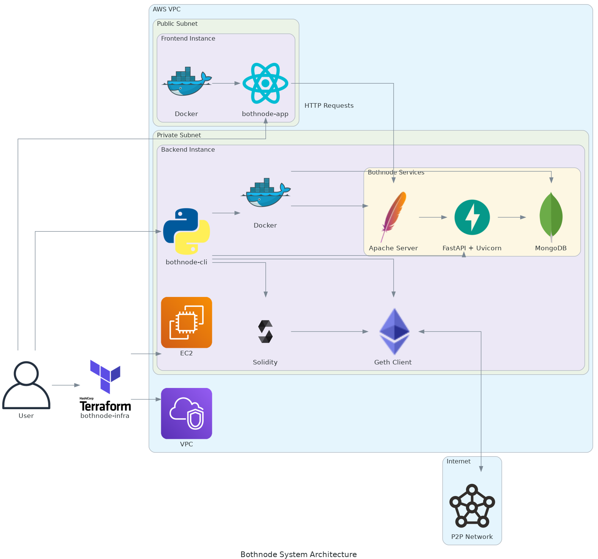

# bothnode-infra
Welcome to bothnode-infra.
```
  |           |    |                     |            _)         _|         
   _ \   _ \   _|    \     \    _ \   _` |   -_) ____| |    \    _| _| _` | 
 _.__/ \___/ \__| _| _| _| _| \___/ \__,_| \___|      _| _| _| _| _| \__,_| 
```

### IaC tool for bothnode: Ethereum Smartcontracs (DeFi) Mitigating the Manipulation
bothnode-infra is powered by Terraform, which allows you to acquire cloud resources via the various providers. It is designed to speed up the setup process crucial for node operation and analysis.

### bothnode architecture
Below is a simple diagram for bothnode system architecture.


bothnode-suite consists of 3 main parts:
- [bothnode](https://github.com/Utatistics/bothnode): provides the CLI tool to interact with node, run transaction and program and conduct analysis
- [bothnode-app](https://github.com/Utatistics/bothnode-app): provides a simple GUI to view the result of transaction as well as analysis
- bothnode-infra: A tool for cloud resource acquisition
  
### Getting Started 
To install Terraform, follow the instructions provided in the [official documentation](https://developer.hashicorp.com/terraform/install).

Use terraform to activate cloud resources in accordance with the predefined configuration. 
```bash
terraform init 
terraform plan
terraform apply -var-file="terraform.tfvars"


Connect to AWS EC2 instance with SSH
```bash
# use ssh
ssh -v -i $SSH_KEY ubuntu@$EC2_IP_ADDRESS

# use the pre-configured ssh script 
./ssh <instance_id> <region>
```
